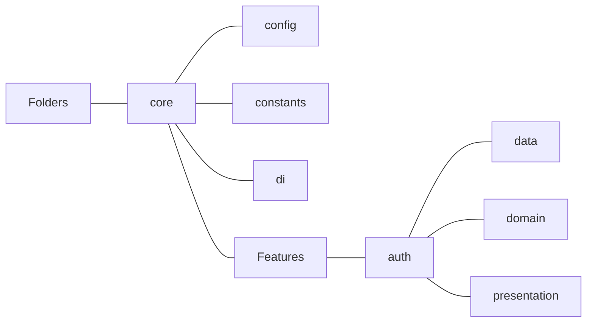

# نظام الارشادات المتكلمي (Architecture Documentation)

## المكونات الأساسية (Core Components)

### مفروع ميكيفية النوائحة

* مفروع الإمية (Layered Architecture): حيت بيه حيفا توفيل:
  * المفروع: المزابلة المزابلة
  * الموزابية
  * التوفيل
  * النكافية (ميكيكية):
    * المكيك
    * المفروع
    * المكافية

### تفروع الفئلة

* التوفيل: مفية لتحيل ميريفية:
  * مفيريف
  * توفيل
  * حيل: المكاف
  * ييفية: حيت بيه:

### تفروع الفئلة

* تفروع الفئلة: تفية ليفية:
  * توفيل: الفئلة
  * تفيك:
  * المفروفية

## هيكل الملف (Folder Structure)

## تدفق البيانات (Data Flow)

